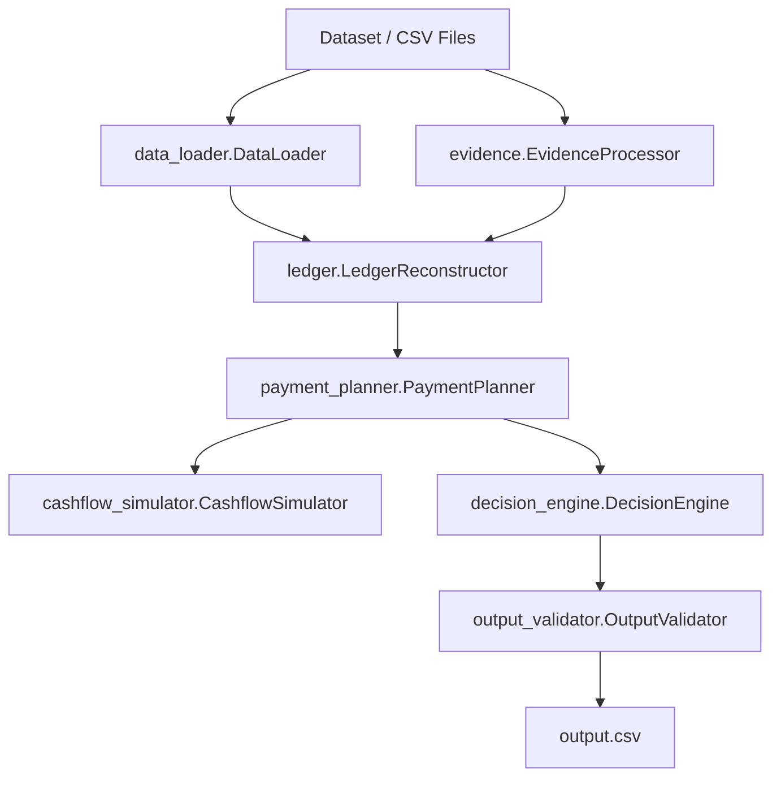

# Buy or Wait? — AI Financial Affordability Engine & Web App

## Overview

This repository contains the **AI Financial Affordability Engine** (*Buy or Wait?*), coupled with a high-end web application interface and optional Firebase integration. The system evaluates user financial requests deterministically to determine affordability over a **90-day forecast horizon**, taking into account current balances, minimum reserve requirements, pending debits/credits, recurring expense streams, exchange rate conversions, and evidence extracted from linked messages and receipts.

---

## Repository Structure

```text
.
├── AGENTS.md                         # System guidance & agent directives
├── README.md                         # Master documentation & technical specification
├── problem_statement.md              # Problem specification & rules
├── output.csv                        # Generated predictions (250 requests + header)
├── log.txt                           # System execution log
├── dataset/                          # Input data directory
│   ├── requests.csv                  # 250 evaluation requests
│   ├── financial_profiles.csv        # User balances & preferences
│   ├── financial_events.csv          # Historic & pending financial transactions
│   ├── request_payment_options.csv   # Pre-calculated installment plans
│   ├── exchange_rates.csv            # Currency exchange rates
│   ├── messages.csv                  # User/system messages
│   └── images.csv                    # Receipts & payroll attachments
├── code/                             # Core Decision Engine package
│   ├── __init__.py                   # Package initializer
│   ├── main.py                       # CLI entry point (python3 code/main.py)
│   ├── data_loader.py                # Dataset loader & object models
│   ├── evidence.py                   # Multi-modal evidence resolution
│   ├── ledger.py                     # Canonical cash flow ledger reconstruction
│   ├── recurrence.py                 # Recurrence stream detection algorithm
│   ├── cashflow_simulator.py        # 90-day daily balance simulation engine
│   ├── payment_planner.py           # Plan candidate generation & safe amount calculations
│   ├── decision_engine.py          # Decision ranking & status determination
│   ├── output_validator.py          # Output schema & business constraint validator
│   ├── test_ledger_fixes.py         # Unit tests for ledger and recurrence
│   └── evaluation/
│       └── usage_report.md          # Token usage and cost report
├── frontend/                         # React + Vite + Firebase Web App
└── tests_v2/
    └── unseen_cases.py               # Synthetic test suite (25 test cases)
```


---

## Technical Specifications & Architecture

The V2 engine follows a strict, modular processing pipeline:



### Module Responsibilities & Core Logic

1. **`data_loader.py`**: Loads and indexes all CSV inputs. Converts monetary amounts into exact `Decimal` precision. Preserves missing/blank event amounts as `None` (never coercing to 0).
2. **`evidence.py`**: Resolves missing event amounts by matching `event_id` or `user_id` in `images.csv` and `messages.csv`.
3. **`ledger.py`**: Reconstructs the user's canonical cash flow timeline:
   - **Event Lifecycle**: Prioritizes Explicit Cancellation $\rightarrow$ Newer Record $\rightarrow$ Settled Event $\rightarrow$ Financially Safer. Excludes failed, cancelled, or unrealized investment debits.
   - **Pending Debits**: Deduplicates identical pending debits and reserves funds.
   - **Currency Conversion**: Converts all foreign transactions to the user's `home_currency` using dated exchange rates.
4. **`recurrence.py`**: Identifies recurring financial streams (`cat::desc` or `cat::ALL`):
   - **Cadences**: Weekly (6–8 day gaps), Biweekly (13–15 day gaps), Ten Days (10 day gaps), Monthly (25–35 day gaps), Long Interval ($\ge 45$ day gaps).
   - Uses standard median gap detection to prevent outlier distortion.
5. **`cashflow_simulator.py`**: Simulates day-by-day account balances across the **90-day forecast horizon**:
   - **Daily Formula**: $\text{Ending Balance} = \text{Start} + \text{Income} - \text{Pending Debits} - \text{Essential Expenses} - \text{Flexible Expenses} - \text{Payment}$.
   - **Safety Rule**: Enforces $\text{Ending Balance} \ge \text{minimum\_balance\_to\_keep}$ for all 90 days.
6. **`payment_planner.py`**: Computes baseline metrics and candidates:
   - `amount_safe_to_pay`: Binary search for the maximum payment safe today without spending changes.
   - `earliest_date_for_full_payment`: First date within 90 days where paying the full amount is safe.
   - **Candidate Generation**: Generates `full_payment`, `partial_payment`, `installments`, and `wait` options according to user profile preferences.
7. **`decision_engine.py`**: Ranks eligible safe candidates using the strict specification hierarchy:
   1. Completion on or before `desired_completion_date`.
   2. Zero spending changes (minimizes disruption).
   3. Minimum total cost.
   4. Earliest start date.
   5. Fewest payments.
   6. Lowest `payment_option_id`.
8. **`output_validator.py`**: Validates generated outputs against CSV schema and business constraints.

---

## Output CSV Schema

Generated output (`output.csv`) follows the exact 8-column format:

| Column Name | Description | Example |
| :--- | :--- | :--- |
| `request_id` | Unique request identifier | `req_001` |
| `amount_safe_to_pay` | Maximum safe payment amount today formatted to 2 decimal places | `150.00` |
| `affordability_status` | Status: `affordable_now`, `affordable_with_plan`, `affordable_later`, `not_affordable` | `affordable_now` |
| `recommended_payment_method` | Method: `full_payment`, `partial_payment`, `installments`, `wait`, `not_recommended` | `full_payment` |
| `payment_plan` | Scheduled payments formatted as `YYYY-MM-DD:amount` separated by `\|` | `2026-04-01:150.00` |
| `earliest_date_for_full_payment` | Earliest safe full payment date (`YYYY-MM-DD` or empty) | `2026-04-01` |
| `spending_changes_needed` | Spending adjustments (`stop:id` or `reduce_to:id:amt`) or `none` | `none` |
| `decision_explanation` | Brief description of decision rationale | `Recommended full_payment...` |

---

## Quick Start & Execution

### Requirements
- **Python 3.10+** (Standard Library only; no third-party dependencies required).
- **Node.js 18+** (For the React + Vite Web App).

### Running the Python Engine

To process all 250 evaluation requests and generate `output.csv`:

```bash
python3 code/main.py
```

### Running the Web Application

```bash
cd frontend
npm install
npm run dev
```

### Running Test Suites

```bash
# Run 25 synthetic unseen test cases
python3 tests_v2/unseen_cases.py

# Run unit tests via pytest
python3 -m pytest code/test_ledger_fixes.py
```

---

## Validation & Verification Summary

### 1. Evaluation Set Validation (250 Requests)

| Constraint | Status | Details |
| :--- | :--- | :--- |
| Row Count | **PASS** | Exactly 250 rows generated |
| Unique Request IDs | **PASS** | 250 unique requests evaluated |
| Status Enum Values | **PASS** | All values within allowed enum set |
| Payment Method Enums | **PASS** | All values within allowed enum set |
| Amount Safe Range | **PASS** | Bounds $[0, \text{requested\_amount}]$ enforced |
| Plan Format | **PASS** | Standard `YYYY-MM-DD:amount` syntax |
| Date Chronology | **PASS** | All payment dates follow request date |
| Decimal Formatting | **PASS** | Exactly 2 decimal places used |
| Schema Compliance | **PASS** | 100% Validated by `OutputValidator` |

### 2. Synthetic Unseen Test Suite Results (`tests_v2/unseen_cases.py`)

- **Total Test Cases**: 25
- **Passed**: 25
- **Failed**: 0
- **Pass Rate**: **100%**


